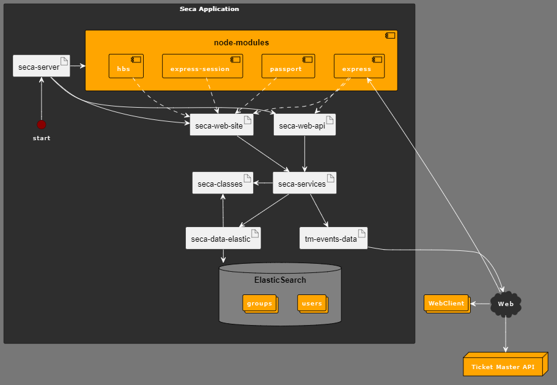

# Shows & Events Chelas Application 

A aplicação Shows & Events Chelas Application (SECA) fornece uma API e um Website que fornecem operações que envolvem pesquisa de eventos e utilização de grupos para organizar ditos eventos. 

Esta wiki visa descrever a aplicação desenvolvida, bem como fornecer instruções de utilização da mesma. Será também incluída nesta wiki a documentação da API para uso.

---

# Estrutura da Aplicação (dependências)



O componente servidor, representado por “seca-server”, é responsável pela interação entre diferentes módulos, componentes e serviços externos. O servidor utiliza um conjunto de módulos Node.js, incluindo **Express**, **Express-session**, **Handlebars** (hbs) e **Passport**, que contribuem coletivamente para o funcionamento do site e da API. É também responsável pela criação das rotas que são utilizadas pelo site e pela api

Os componentes seca-web-site e seca-web-api são responsáveis pela implementação das rotas utilizadas no servidor, para o site e a api respetivamente.

A API, representada por "seca-web-api", é responsável pela implementação das rotas da API que fornecem operações de grupos e pesquisa de eventos. Esta API processa os pedidos dos utilizadores, gere a autenticação do utilizador e a interação com os serviços da aplicação.

O site, representado por "seca-web-site", é responsável pela implementação das rotas que permitem ao utilizador utilizar um browser, continuando a ter acesso a todas as funcionalidades fornecidas pela API.

O componente "seca-services" inclui vários serviços responsáveis pelo processamento de pedidos do utilizador, abrangendo a criação e gestão de dados de utilizadores, grupos e a integração com fontes externas de dados como a API do TicketMaster.

O cliente web, designado como "WebClient", é a interface do utilizador que interage com o a aplicação SECA, permitindo aos utilizadores ter acesso às funcionalidades oferecidas pela aplicação.

"seca-data-elastic" gere os dados do ElasticSearch. Este garante o armazenamento das informações dos utilizadores e grupos e permite a gestão dos mesmos.

"tm-events-data" faz a ligação dos dados externos da API TicketMaster com a aplicação. Esta integração permite os pedidos à API TicketMaster com base nos parametros definidos pelo utlizador, de forma a obter informação acerca de eventos. 

---

# Armazenamento via ElasticSearch 

Para armazenamento de dados foram criados os seguintes índices:

## Groups

  - ID - Identificador único do grupo

  - userID - Utilizador a que o grupo pertence (inclui as propriedades ID, name, e token do utilizador)

  - name - Nome do grupo

  - description : Descrição do grupo

## Users

  - ID - Identificador único do utilizador

  - name - Nome do utilizador

  - token - Token do utilizador para autorização

  - hash - Palavra-passe do utilizador encriptada

Cada utilizador pode ter vários grupos e cada grupo pertence a apenas um utilizador (1:N).

Um grupo pode ter vários eventos, com a exceção de que não pode ter eventos repetidos.

---
# Instruções para utilização da aplicação
  - Deve ter Node.js instalado na sua máquina
  - Deve ter ElasticSearch instalado na sua máquina

  1. Executar o comando `npm install` em linha de comandos no diretório da aplicação para instalar todas as dependências
  2. Executar ElasticSearch localmente no porto 9200
  3. Executar o comando `node seca-server.mjs` em linha de comandos no diretório da aplicação
  
  Para utilizar o site, abrir um browser e inserir o url `http://localhost:1904/site/home`.

  Para utilizar a API, utilizar Postman ou outra ferramenta que permita realizar pedidos HTTP à API.

  Para executar os testes, executar o comando `npm test`


---
# SECA API Documentation 

## Event Operations

Event Operations do not require authorization

## `GET /events`

*Search events by name*

By passing in a name, you can search for events

<h3>Parameters</h3>

|Name|In|Type|Required|Description|
|---|---|---|---|---|
|name|query|string|true|The name to search for|
|s|query|integer|false|number of events to return|
|p|query|integer|false|the page number of the results to show|


<h3>Responses</h3>

|Status|Meaning|Description|
|---|---|---|
|200|[OK](https://developer.mozilla.org/en-US/docs/Web/HTTP/Status/200)|Returns events that match the name, with the specified amount of results and page number|
|400|[Bad Request](https://developer.mozilla.org/en-US/docs/Web/HTTP/Status/400)|Invalid Request because of a missing Parameter, invalid body content or lack of authorization|


<h3>Response Example</h3>

> 200
```json
[
    {
        "id": "Z7r9jZ1A7e9ZU",
        "name": "Washington Huskies Football vs. Weber State Wildcats Football",
        "genre": "Football",
        "segment": "Sports"
    },
    {
        "id": "Z7r9jZ1A7e9ZM",
        "name": "Washington Huskies Football vs. Eastern Michigan Eagles Football",
        "genre": "Football",
        "segment": "Sports"
    },
    {
        "id": "Z7r9jZ1A77v4N",
        "name": "Rutgers Scarlet Knights Football vs. Washington Huskies Football",
        "genre": "Football",
        "segment": "Sports"
    }
]
```


> Javascript Example

```javascript

const headers = {
  'Accept':'application/json'
};

fetch('http://localhost:1904/events?name=string',
{
  method: 'GET',
  headers: headers
})
.then(function(res) {
    return res.json();
}).then(function(body) {
    console.log(body);
});

```

## `GET /events/popular`

*Search most popular eventss*

By passing in arguments, you can search for the most popular events

<h3>Parameters</h3>

|Name|In|Type|Required|Description|
|---|---|---|---|---|
|s|query|integer|false|number of events to return|
|p|query|integer|false|the page number of the results to show|

<h3>Responses</h3>

|Status|Meaning|Description|
|---|---|---|
|200|[OK](https://developer.mozilla.org/en-US/docs/Web/HTTP/Status/200)|Returns the list of most popular events|
|400|[Bad Request](https://developer.mozilla.org/en-US/docs/Web/HTTP/Status/400)|Invalid Request because of a missing Parameter, invalid body content or lack of authorization|

> Javascript Example

```javascript

const headers = {
  'Accept':'application/json'
};

fetch('http://localhost:1904/events/popular',
{
  method: 'GET',
  headers: headers
})
.then(function(res) {
    return res.json();
}).then(function(body) {
    console.log(body);
});

```


## `GET /events/{id}`

*Get more details of specific event*

<h3>Parameters</h3>

|Name|In|Type|Required|Description|
|---|---|---|---|---|
|id|query|string|false|The event id|

<h3>Responses</h3>

|Status|Meaning|Description|
|---|---|---|
|200|[OK](https://developer.mozilla.org/en-US/docs/Web/HTTP/Status/200)|Event details returned|
|400|[Bad Request](https://developer.mozilla.org/en-US/docs/Web/HTTP/Status/400)|Invalid Request because of a missing Parameter|

<h3>Response Example</h3>

> 200
```json
{
    "id": "Z7r9jZ1A7e9ZU",
    "name": "Washington Huskies Football vs. Weber State Wildcats Football",
    "genre": "Football",
    "segment": "Sports",
    "subGenre": "College",
    "image": "https://s1.ticketm.net/dam/a/24a/6bd9bf77-cfc8-4922-aad8-f1687834d24a_1257311_TABLET_LANDSCAPE_16_9.jpg",
    "salesStartTime": "1900-01-01T18:00:00Z",
    "salesEndTime": "2024-09-01T06:59:20Z"
}
```


> Javascript Example

```javascript

const headers = {
  'Accept':'application/json'
};

fetch('http://localhost:1904/events/Z7r9jZ1A7e9ZU',
{
  method: 'GET',
  headers: headers
})
.then(function(res) {
    return res.json();
}).then(function(body) {
    console.log(body);
});

```


## User Operations

## `POST /users`

*Creates a user*


> Body parameter

```json
{
  "username": "António Paulino"
}
```

<h3>Parameters</h3>

|Name|In|Type|Required|Description|
|---|---|---|---|---|
|username|body|string|true|New user name|

<h3>Responses</h3>

|Status|Meaning|Description|
|---|---|---|
|201|[Created](https://tools.ietf.org/html/rfc7231#section-6.3.2)|New user created|
|400|[Bad Request](https://developer.mozilla.org/en-US/docs/Web/HTTP/Status/400)|Invalid Request because of a missing Parameter, invalid body content or lack of authorization|

<h3>Response Example</h3>

> 201

```json
{
  "token":"497f6eca-6276-4993-bfeb-53cbbbba6f08"
}
```

> Javascript Example

```javascript

const inputBody = {
  "username": "António Paulino"
};

const headers = {
  'Content-Type':'application/json',
  'Accept':'application/json'
};

fetch('http://localhost:1904/users',
{
  method: 'POST',
  body: inputBody,
  headers: headers
})
.then(function(res) {
    return res.json();
}).then(function(body) {
    console.log(body);
});

```


## Group Operations

To perform group operations, you must be authenticated via HTTP bearerAuth

## `GET /groups`

*Gets all groups belonging to a user*

<h3>Parameters</h3>

|Name|In|Type|Required|Description|
|---|---|---|---|---|
|Authorization|header|string(uuid)|true|user token for identification|


<h3>Responses</h3>

|Status|Meaning|Description
|---|---|---|
|200|[OK](https://developer.mozilla.org/en-US/docs/Web/HTTP/Status/200)|Groups returned|
|400|[Bad Request](https://developer.mozilla.org/en-US/docs/Web/HTTP/Status/400)|Invalid Request because of a missing Parameter, invalid body content or lack of authorization|
|401|[Unauthorized](https://developer.mozilla.org/en-US/docs/Web/HTTP/Status/401)|No Authorization|
|404|[Not Found](https://developer.mozilla.org/en-US/docs/Web/HTTP/Status/404)|Resource not found|


> JavaScript Example

```javascript

const headers = {
  'Accept':'application/json',
  'Authorization':'497f6eca-6276-4993-bfeb-53cbbbba6f08'
};

fetch('http://localhost:1904/groups',
{
  method: 'GET',
  headers: headers
})
.then(function(res) {
    return res.json();
}).then(function(body) {
    console.log(body);
});

```


## `POST /groups`

*Create Group*

Add group to list of groups belonging to user

> Body parameter

```json
{
  "name": "Football group",
  "description": "Group that contains football events"
}
```

<h3>Parameters</h3>

|Name|In|Type|Required|Description|
|---|---|---|---|---|
|Authorization|header|string(uuid)|true|user token for identification|
|name|body|string|true|Group name|
|description|body|string|true|Group description|


<h3>Responses</h3>

|Status|Meaning|Description|
|---|---|---|
|201|[Created](https://tools.ietf.org/html/rfc7231#section-6.3.2)|Group created|
|400|[Bad Request](https://developer.mozilla.org/en-US/docs/Web/HTTP/Status/400)|Invalid Request because of a missing Parameter, invalid body content or lack of authorization|
|401|[Unauthorized](https://developer.mozilla.org/en-US/docs/Web/HTTP/Status/401)|No Authorization|
|404|[Not Found](https://developer.mozilla.org/en-US/docs/Web/HTTP/Status/404)|Resource not found|[NotFoundError](#schemanotfounderror)|


> Javascript example


```javascript
const inputBody = {
  "name": "Football group",
  "description": "Group that contains football events"
};

const headers = {
  'Content-Type':'application/json',
  'Accept':'application/json',
  'Authorization':'497f6eca-6276-4993-bfeb-53cbbbba6f08'
};

fetch('http://localhost:1904/groups',
{
  method: 'POST',
  body: inputBody,
  headers: headers
})
.then(function(res) {
    return res.json();
}).then(function(body) {
    console.log(body);
});
```

## `GET group/{id}`

*Get a specific group given its id*

<h3>Parameters</h3>

|Name|In|Type|Required|Description|
|---|---|---|---|---|
|Authorization|header|string(uuid)|true|user token for identification|
|id|path|string(uuid)|true|ID of group to get|


<h3>Responses</h3>

|Status|Meaning|Description|
|---|---|---|
|200|[OK](https://developer.mozilla.org/en-US/docs/Web/HTTP/Status/200)|Group returned|
|400|[Bad Request](https://developer.mozilla.org/en-US/docs/Web/HTTP/Status/400)|Invalid Request because of a missing Parameter, invalid body content or lack of authorization|
|401|[Unauthorized](https://developer.mozilla.org/en-US/docs/Web/HTTP/Status/401)|No Authorization|
|404|[Not Found](https://developer.mozilla.org/en-US/docs/Web/HTTP/Status/404)|Resource not found|


<h3>Response Example</h3>

> 200
```json
{
    "id": "a5ab7d81-f7df-4d76-9acf-0d3c0c73649f",
    "userID": {
        "name": "user 1",
        "token": "e5ab7d81-f7df-4d76-9acf-0d3c0c73649f",
        "id": "f0sKv4wBUSONURCKVo76"
    },
    "name": "Test group user 1",
    "description": "This is a test group that belongs to user 1",
    "events": []
}
```
 
> Javascript Example

```javascript

const headers = {
  'Accept':'application/json',
  'Authorization':'497f6eca-6276-4993-bfeb-53cbbbba6f08'
};

fetch('http://localhost:1904/group/{id}',
{
  method: 'GET',
  headers: headers
})
.then(function(res) {
    return res.json();
}).then(function(body) {
    console.log(body);
});

```


## `DELETE /group/{id}`

*Delete a Group given its id*

<h3>Parameters</h3>

|Name|In|Type|Required|Description|
|---|---|---|---|---|
|Authorization|header|string(uuid)|true|user token for identification|
|id|path|string(uuid)|true|ID of group to delete|


<h3>Responses</h3>

|Status|Meaning|Description|
|---|---|---|
|200|[OK](https://developer.mozilla.org/en-US/docs/Web/HTTP/Status/200)|Group deleted|
|400|[Bad Request](https://developer.mozilla.org/en-US/docs/Web/HTTP/Status/400)|Invalid Request because of a missing Parameter, invalid body content or lack of authorization|
|401|[Unauthorized](https://developer.mozilla.org/en-US/docs/Web/HTTP/Status/401)|No Authorization|
|404|[Not Found](https://developer.mozilla.org/en-US/docs/Web/HTTP/Status/404)|Resource not found|

> Javascript Example

```javascript

const headers = {
  'Accept':'application/json',
  'Authorization':'497f6eca-6276-4993-bfeb-53cbbbba6f08'
};

fetch('http://localhost:1904/group/{id}',
{
  method: 'DELETE',

  headers: headers
})
.then(function(res) {
    return res.json();
}).then(function(body) {
    console.log(body);
});

```

## `PUT /group/{id}`

*Update a group's name and description given its id*

> Body parameter

```json
{
  "name": "Football group",
  "description": "Group that contains football events"
}
```

<h3>Parameters</h3>

|Name|In|Type|Required|Description|
|---|---|---|---|---|
|Authorization|header|string(uuid)|true|user token for identification|
|id|path|string(uuid)|true|ID of group to update|
|name|body|string|true|New group name|
|description|body|string|true|New group description|

<h3> Responses </h3>

|Status|Meaning|Description|
|---|---|---|
|200|[OK](https://developer.mozilla.org/en-US/docs/Web/HTTP/Status/200)|Group Updated|
|400|[Bad Request](https://developer.mozilla.org/en-US/docs/Web/HTTP/Status/400)|Invalid Request because of a missing Parameter, invalid body content or lack of authorization|
|401|[Unauthorized](https://developer.mozilla.org/en-US/docs/Web/HTTP/Status/401)|No Authorization|
|404|[Not Found](https://developer.mozilla.org/en-US/docs/Web/HTTP/Status/404)|Resource not found|

> Javascript Example

```javascript
const inputBody = {
  "name": "Football group",
  "description": "Group that contains football events"
};
const headers = {
  'Content-Type':'application/json',
  'Accept':'application/json',
  'Authorization':'497f6eca-6276-4993-bfeb-53cbbbba6f08'
};

fetch('http://localhost:1904/group/{id}',
{
  method: 'PUT',
  body: inputBody,
  headers: headers
})
.then(function(res) {
    return res.json();
}).then(function(body) {
    console.log(body);
});

```

## `PUT /group/{id}/events`

*Add new event to Group*

> Body parameter

```json
{
  "id": "Z7r9jZ1AdOvFN"
}
```

<h3>Parameters</h3>

|Name|In|Type|Required|Description|
|---|---|---|---|---|
|Authorization|header|string(uuid)|true|user token for identification|
|id|path|string(uuid)|true|ID of group to add event|
|id|body|string|true|ID of event to add|

<h3>Responses</h3>

|Status|Meaning|Description|
|---|---|---|
|200|[OK](https://developer.mozilla.org/en-US/docs/Web/HTTP/Status/200)|Event added|
|400|[Bad Request](https://developer.mozilla.org/en-US/docs/Web/HTTP/Status/400)|Invalid Request because of a missing Parameter, invalid body content or lack of authorization|
|401|[Unauthorized](https://developer.mozilla.org/en-US/docs/Web/HTTP/Status/401)|No Authorization|
|404|[Not Found](https://developer.mozilla.org/en-US/docs/Web/HTTP/Status/404)|Resource not found|

> Javascript Example

```javascript

const inputBody = {
  "id": "Z7r9jZ1AdOvFN"
};

const headers = {
  'Content-Type':'application/json',
  'Accept':'application/json',
  'Authorization':'497f6eca-6276-4993-bfeb-53cbbbba6f08'
};

fetch('http://localhost:1904/group/{id}/events',
{
  method: 'PUT',
  body: inputBody,
  headers: headers
})
.then(function(res) {
    return res.json();
}).then(function(body) {
    console.log(body);
});

```


## `DELETE /group/{groupID}/events/${eventID}`

*Remove event from group*

<h3>Parameters</h3>

|Name|In|Type|Required|Description|
|---|---|---|---|---|
|Authorization|header|string(uuid)|true|user token for identification|
|groupID|path|string(uuid)|true|ID of group to add event|
|eventID|path|string|true|ID of event to remove|

<h3>Responses</h3>

|Status|Meaning|Description|
|---|---|---|
|200|[OK](https://developer.mozilla.org/en-US/docs/Web/HTTP/Status/200)|Event removed|
|400|[Bad Request](https://developer.mozilla.org/en-US/docs/Web/HTTP/Status/400)|Invalid Request because of a missing Parameter, invalid body content or lack of authorization|
|401|[Unauthorized](https://developer.mozilla.org/en-US/docs/Web/HTTP/Status/401)|No Authorization|
|404|[Not Found](https://developer.mozilla.org/en-US/docs/Web/HTTP/Status/404)|Resource not found|

> Javascript Example

```javascript

const headers = {
  'Accept':'application/json',
  'Authorization':'497f6eca-6276-4993-bfeb-53cbbbba6f08'
};

fetch('http://localhost:1904/group/{groupID}/events/${eventID}',
{
  method: 'DELETE',
  headers: headers
})
.then(function(res) {
    return res.json();
}).then(function(body) {
    console.log(body);
});

```

